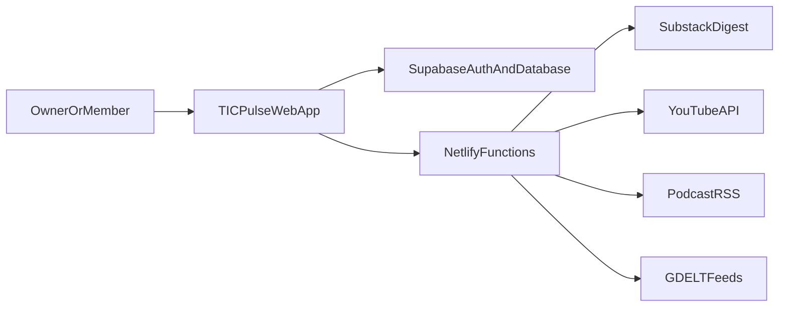
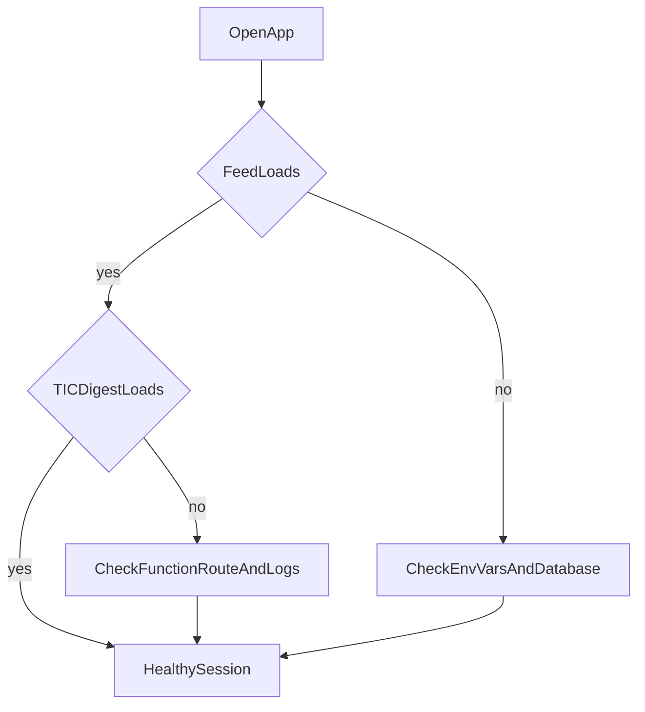

# TIC Pulse - Owner Guide

ALL RISE FOR THE --TIC Anthem--

If you are reading this, play the anthem:

- [Play "Talent Intelligence_ A National Anthem.mp3"](/TIC-Anthem/Talent%20Intelligence_%20A%20National%20Anthem.mp3)

If your markdown viewer does not embed audio players, open the link directly and your browser media player will start playback.


This document is written for non-developers who now manage the app.

TIC Pulse is a mobile-first intelligence app for Talent Intelligence Collective. It gathers news, podcasts, and videos, then presents them in one place so members can read, watch, listen, save, and curate content.

## What Changed In The Refactor

### What we did

- Moved the app to stricter TypeScript and schema validation (fewer silent data mistakes).
- Standardized database and migration files so a fresh setup is reproducible.
- Cleaned up Netlify Functions and scheduling so ingestion pipelines are easier to reason about.
- Added automated checks (typecheck, unit tests, e2e smoke tests, CI workflow).
- Added stronger release process documentation (`RELEASE-CHECKLIST.md`).

### Why this is a good thing

- **Safer changes:** mistakes are caught earlier by automated checks.
- **Easier onboarding:** new owners can set up from documented steps.
- **Lower risk operations:** deploys and handoffs are repeatable.
- **Better maintainability:** clearer boundaries between frontend, database, and ingestion functions.

### Positive impact you should feel

- Fewer "mystery failures" after edits.
- Faster troubleshooting when a feed does not load.
- Easier transfer to another maintainer without losing context.

## System Overview





## Quick Start

### You need

- Node.js 20+
- A Supabase project
- A Netlify project (for scheduled/background functions)

### First local run

1. Clone repository and open the folder that contains `package.json`.
2. Copy `.env.example` to `.env`.
3. Fill at least `VITE_SUPABASE_URL` and `VITE_SUPABASE_ANON_KEY`.
4. Install dependencies: `npm ci`
5. Start app: `npm run dev` (default: `http://localhost:5173`)

### Important note for TIC Digest in local development

The TIC Digest tab calls a Netlify Function route (`/.netlify/functions/fetch-substack`).

- If you only run `npm run dev`, that function might not exist locally.
- For Digest testing, run local Netlify runtime (example: `npx netlify dev`) so function routes are available.
- Vite proxy is configured to forward `/.netlify/functions/*` to `http://localhost:8888` during local development.

## Database Setup

Run migration in order:

- `supabase/migrations/00000000000000_initial_schema.sql`

Use a fresh Supabase project for first setup, then validate tables/RPCs against:

- `schema/inventory.md`
- `docs/AGENT-TECHNICAL-AUDIT.md`

## Admin Features (How To Use)

### 1) Safety checks before release

Run:

```bash
npm run typecheck
npm test
npm run build
npm run test:e2e
```

What each check does:

- `typecheck`: catches TypeScript errors before runtime.
- `npm test`: runs unit tests (logic/schema validation checks).
- `build`: verifies production bundle can be generated.
- `test:e2e`: runs Playwright smoke checks for essential UI behavior.

### 2) E2E testing (Playwright)

- Config file: `playwright.config.ts`
- Current smoke tests: `e2e/smoke.spec.ts`
- Use this when you want confidence that app shell/auth entry flow still opens.
- For broader coverage, add new tests in `e2e/` for major user journeys.

### 3) Operational runbook

- Pre-release list: `RELEASE-CHECKLIST.md`
- Scheduled jobs config: `netlify.toml`
- Environment template: `.env.example`

## Monthly Cost Snapshot (Before vs After Refactor)

These are planning estimates, not invoices. Real cost varies with traffic and API usage.

### Assumptions

- Small-to-medium community usage.
- Same user base before and after refactor.
- Netlify/Supabase plans remain unchanged.
- Main variability driver: API calls + summarization usage.

### Comparative estimate (conservative, intentionnally) 

- Frontend hosting + functions: before `$25-$60/mo`, after `$20-$45/mo` (cleaner schedules/caps reduce noisy invocations).
- Database (Supabase): before `$25-$50/mo`, after `$25-$45/mo` (better query and ingestion discipline lowers spikes).
- External APIs (YouTube/LLM/etc.): before `$20-$120/mo`, after `$10-$70/mo` (caps and batching reduce over-processing).
- Debugging/rework time (owner effort): before high, after medium-low (better tests/checklists reduce fire-fighting).
- Total expected range: before `$70-$230/mo`, after `$55-$160/mo`.

Plain-English interpretation:

- **Best case:** roughly 30-40% cheaper.
- **Typical case:** 20-30% cheaper.
- **Worst case:** similar cost to before if API usage spikes. But this would likely be a rogue many users with bad intentions (aka could be caught long before you need to sell a kidney)

## If Something Breaks

Start in this order:

1. Run `npm run typecheck` and `npm run build`.
2. Confirm required env vars are present (`.env.example` as source of truth).
3. Check Netlify Function logs for failing endpoints.
4. Confirm scheduled function names match `netlify.toml`.
5. Re-run `npm run test:e2e` for quick UI sanity.


## Key References

- `RELEASE-CHECKLIST.md`
- `docs/AGENT-TECHNICAL-AUDIT.md`
- `schema/inventory.md`
- `netlify.toml`
- `.env.example`
